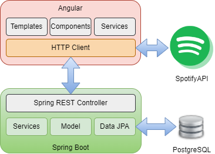
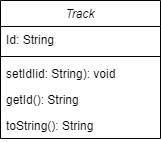

# SpotifyAPI DRA22

Collective project where the knowledge acquired in the subject will be put into practice, taking as an example Spotify API to query data about albums, artists, tracks, etc… - Rapid Application Development 2022 UAL

## Architecture

This project's frontend is built using Angular from where the request to the [API](https://developer.spotify.com/documentation/web-api/) are made. The backend is built using Spring Boot which communicate with the PostgreSQL data base.

In the data base we only save the Track id, the same id that the API use:

To communicate front with back, we used HTTP requests to the created endpoints of the backend:

### Get

It returns the list of all the Tracks that the data base have.

### Get(id: String)

It returns a Track by its id.

### Post(track: Track)

It saves the track in the data base.

### Delete(id: String)

It removes a track from the data base by its id.

Using the same backend, we have a endpoint to return the events of the year in Spain.

## Developer
Cristian David Casado [https://github.com/CristianDC27](https://github.com/CristianDC27)

## License

Copyright 2022 DRA - Tasty Team

Permission is hereby granted, free of charge, to any person obtaining a copy of this software and associated documentation files (the "Software"), to deal in the Software without restriction, including without limitation the rights to use, copy, modify, merge, publish, distribute, sublicense, and/or sell copies of the Software, and to permit persons to whom the Software is furnished to do so, subject to the following conditions:

The above copyright notice and this permission notice shall be included in all copies or substantial portions of the Software.

THE SOFTWARE IS PROVIDED "AS IS", WITHOUT WARRANTY OF ANY KIND, EXPRESS OR IMPLIED, INCLUDING BUT NOT LIMITED TO THE WARRANTIES OF MERCHANTABILITY, FITNESS FOR A PARTICULAR PURPOSE AND NONINFRINGEMENT. IN NO EVENT SHALL THE AUTHORS OR COPYRIGHT HOLDERS BE LIABLE FOR ANY CLAIM, DAMAGES OR OTHER LIABILITY, WHETHER IN AN ACTION OF CONTRACT, TORT OR OTHERWISE, ARISING FROM, OUT OF OR IN CONNECTION WITH THE SOFTWARE OR THE USE OR OTHER DEALINGS IN THE SOFTWARE.
